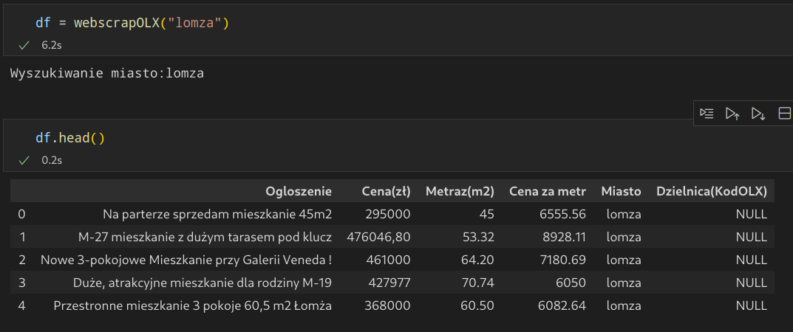
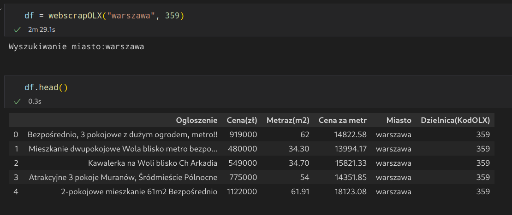

# Simple script for web scraping apartments from polish site OLX

It gives us one function which recturn dataframe with data: webscrapOLX()
We can use it in two ways:
```sh
webscrapOLX(city)
```


```sh
webscrapOLX(city, distric_code)
```

